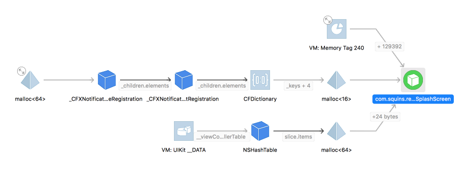

# Non-Freed Object Issue

Status:  reproduced

At first, SplashScreen is displayed.

After a few seconds, it is replaced by SecondScreen.

Observations:

* In the XCode debugger there is still a SplashScreen instance active (it is not referenced any more from our codebase)
* SplashScreen.finalize() is never called.

